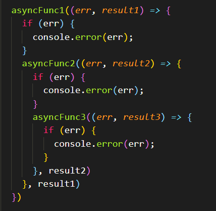
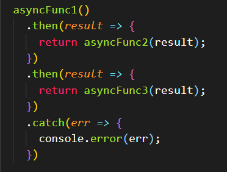

# async/await

---

### 概念

<code>async</code> 关键字用于声明异步函数。

async 函数返回一个 Promise 对象，可以使用 then 方法添加回调函数。当函数执行的时候，一旦遇到 await 就会先返回，等到触发的异步操作完成，再接着执行函数体内后面的语句。

<code>await</code> 关键字

1. await 后面接一个会 return new promise 的函数并执行它
2. await 只能放在 async 函数里
3. 如果 await 后面跟的是其他值，则直接返回该值
    <!-- * 每次使用 await 都会创建一个 promise 对象，然后把剩下的 async 函数中的操作放到 then 回调函数中 -->

!> async/await 是 promise 的语法糖

```js
function 摇色子(){
    return new Promise((resolve, reject)=>{
        let sino = parseInt(Math.random() * 6 +1)
        setTimeout(()=>{
            resolve(sino)
        },3000)
    })
}
async function test(){
    let n = await 摇色子();
    console.log(n);
}
test()
```

### 注意

await 命令后面的 Promise 对象，运行结果可能是 rejected，所以最好把 await 命令放在 try...catch 代码块中。

```js
async function test(){
    try {
        let n = await 摇色子();
        console.log(n);
    } catch (err) {
        console.log(err);
    }   
}
```

<div class="fx">
<div>

### callback



<!-- ```js
asyncFunc1((err, result1) => {
  if (err) {
    console.error(err);
  }
  asyncFunc2((err, result2) => {
    if (err) {
      console.error(err);
    }
    asyncFunc3((err, result3) => {
      if (err) {
        console.error(err);
      }
    }, result2)
  }, result1)
})
``` -->

</div>
<div>

### promise



<!-- ```js
asyncFunc1()
.then(result => {
  return asyncFunc2(result);
})
.then(result => {
  return asyncFunc3(result);
})
.catch(err => {
  console.error(err);
})
``` -->

</div>
<div>

### async await


<!-- ```js
async function asyncMain(){
  try {
    const result = await asyncFunc1();
    result = await asyncFunc2(result);
    result = await asyncFunc3(result);
  } catch (err) {
    console.error(err);
  }
}
``` -->

</div>
</div>
